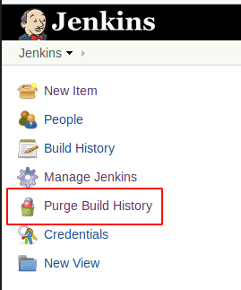
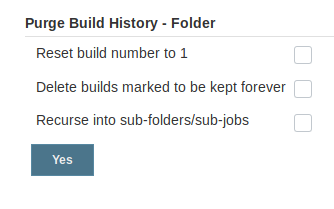

Jenkins Purge Job History Plugin
=====================

This plugin provides ability to purge all build history of;
- Job
- Pipeline
- MultiBranch Job (Recursive Flag is Needed)
- Jobs under a Folder (Recursive Flag is Needed)
- All Job under Jenkins Instance (Recursive Flag is Needed)

Usage
=====================
Go to a Job (Any type of) or a Folder and click on the "Purge Build History" link on the left menu.

Select none or all of the options.
- Reset build number to 1: Resets the next build number 1 if all the builds are deleted.
- Delete builds marked to be kept forever: Als delete any builds even they are marked to keep forever.
- Recurse into sub-folders/sub-jobs: Recurse into all Jobs/Folders under the selected Job/Folder

Note: If you click "Purge Build History" link on the main page of the Jenkins. Plugin will recurse into
all Jobs/Folder and delete the builds depending on your selection.

Example Screenshots;

Logs
=====================
Depending on the Job/Folder and the selections, purge action can take long time. 
You can follow the process from the Jenkins Logs
